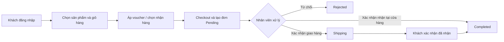

# Hệ thống quản lý vận hành siêu thị

Hệ thống hỗ trợ vận hành một siêu thị quy mô nhỏ từ danh mục hàng hóa, tồn kho, nhân sự đến bán hàng tại cửa hàng và tiếp nhận đơn trực tuyến. Mục tiêu không chỉ là tạo đơn, mà là đưa các hoạt động hằng ngày về một luồng dữ liệu chung để người quản lý có thể theo dõi hàng hóa, đơn hàng, doanh thu và hiệu suất vận hành.

> Phạm vi README này phản ánh chức năng hiện có trong source code. Đây là tài liệu tổng quan nghiệp vụ và cách vận hành, không thay thế quy trình kế toán, hóa đơn điện tử hoặc quy định nội bộ của một siêu thị cụ thể.

## 1. Bài toán nghiệp vụ

Trong vận hành siêu thị, các vấn đề thường gặp là hàng hóa và số lượng tồn được quản lý rời rạc; đơn online cần nhân viên xác nhận; trạng thái thanh toán, giao hàng và nhận hàng khó theo dõi; lịch làm việc và hiệu suất nhân viên không được liên kết với hoạt động bán hàng.

Hệ thống tập trung giải quyết các nhu cầu sau:

1. Duy trì một danh mục sản phẩm, giá bán, đơn vị tính, mã quét và tồn kho có thể dùng chung cho vận hành.
2. Ghi nhận các biến động nhập, xuất và điều chỉnh tồn kho kèm người thực hiện, lý do và thời điểm.
3. Quản lý vòng đời đơn hàng, đặc biệt là đơn trực tuyến từ lúc khách đặt đến khi hoàn tất hoặc bị từ chối.
4. Hỗ trợ khách hàng tự phục vụ: đăng ký, đăng nhập, giỏ hàng, voucher, thanh toán, theo dõi đơn và đánh giá sản phẩm.
5. Cung cấp cho quản lý các màn hình điều hành về sản phẩm, nhân sự, ca làm việc, tồn kho, doanh thu và hiệu suất.

## 2. Phạm vi chức năng hiện tại

| Phân hệ | Nghiệp vụ được hỗ trợ |
|---|---|
| Danh mục hàng hóa | Danh mục, sản phẩm, hình ảnh, mã sản phẩm/mã quét, giá và đơn vị tính. |
| Kho | Tạo mặt hàng kho, nhập hàng, xuất hàng, điều chỉnh sau kiểm tra, cảnh báo sắp hết hàng và lịch sử biến động. |
| Bán hàng | Tạo và quản lý đơn hàng, chi tiết đơn, trạng thái đơn, lịch sử mua hàng và doanh thu. |
| Bán hàng trực tuyến | Giỏ hàng, checkout, nhận tại cửa hàng hoặc giao hàng, xác nhận đơn và khách xác nhận đã nhận. |
| Khách hàng | Hồ sơ, địa chỉ, voucher, điểm tích lũy, đánh giá sản phẩm và khôi phục mật khẩu. |
| Nhân sự | Tài khoản nhân viên, lịch làm việc theo tháng, bắt đầu/kết thúc ca và tổng hợp ca. |
| Điều hành | Báo cáo doanh thu theo kỳ, hiệu suất sản phẩm, quản lý voucher và theo dõi đơn trực tuyến. |
| Thanh toán | VNPay, QR chuyển khoản và webhook/xác nhận thanh toán theo cấu hình môi trường. |

## 3. Vai trò và trách nhiệm

Hệ thống hiện có ba vai trò chính. Quyền cần được kiểm tra ở backend, không chỉ ẩn/hiện giao diện.

| Vai trò | Trách nhiệm vận hành chính |
|---|---|
| Quản trị viên (`admin`) | Quản lý nhân viên, danh mục và sản phẩm; theo dõi tồn; quản lý voucher; xem báo cáo và hiệu suất; điều phối hoạt động. |
| Nhân viên (`employee`) | Bắt đầu/kết thúc ca, quét hàng, xử lý/xác nhận đơn trực tuyến, hỗ trợ nhập–xuất–kiểm tra tồn theo quyền được cấp. |
| Khách hàng (`customer`) | Đăng ký/đăng nhập, tìm sản phẩm, quản lý giỏ, áp voucher, đặt hàng, thanh toán, theo dõi đơn, nhận hàng và đánh giá. |

## 4. Các đối tượng nghiệp vụ cốt lõi

| Đối tượng | Ý nghĩa trong vận hành |
|---|---|
| Sản phẩm và danh mục | Danh mục hàng đang bán; chứa thông tin nhận diện, giá, đơn vị, ảnh và mã quét. |
| Mặt hàng tồn kho | Bản ghi số lượng tồn phục vụ nhập, xuất, kiểm tra và cảnh báo tồn thấp. |
| Nhật ký tồn kho | Dấu vết của một lần nhập, xuất hoặc điều chỉnh, bao gồm số lượng, người thực hiện và ghi chú. |
| Giỏ hàng | Nhu cầu mua tạm thời của khách trước khi checkout. |
| Đơn hàng và dòng đơn | Cam kết bán hàng, danh sách sản phẩm, số tiền, hình thức nhận, trạng thái xử lý và thanh toán. |
| Thanh toán | Giao dịch liên kết với đơn hàng, dùng để theo dõi phương thức và trạng thái thanh toán. |
| Voucher và điểm | Chính sách khuyến mại/khách hàng thân thiết được áp dụng hoặc tích lũy theo đơn. |
| Ca làm việc và lịch làm việc | Khung thời gian làm của nhân viên và dữ liệu tổng hợp phục vụ điều hành. |

## 5. Luồng vận hành chính

### 5.1. Chuẩn bị hàng hóa và tồn kho

1. Quản trị viên tạo danh mục, sản phẩm hoặc mặt hàng tồn kho; có thể gắn ảnh và mã quét.
2. Khi hàng về, nhân viên nhập số lượng và giá nhập. Hệ thống tăng tồn và tạo nhật ký nhập.
3. Khi có hoạt động xuất kho, hệ thống giảm tồn và tạo nhật ký xuất.
4. Khi kiểm tra phát hiện chênh lệch, người vận hành tạo điều chỉnh với ghi chú thay vì tự sửa số lượng không có lý do.
5. Quản lý theo dõi tồn thấp, lịch sử biến động và hiệu suất sản phẩm để có quyết định bổ sung hàng.

### 5.2. Bán hàng tại cửa hàng

1. Nhân viên bắt đầu ca làm việc.
2. Nhân viên chọn hoặc quét mã sản phẩm, lập đơn bán hàng và ghi nhận hình thức thanh toán.
3. Đơn bán tại cửa hàng được hoàn tất sau khi xử lý; dữ liệu đơn tham gia vào báo cáo doanh thu và hiệu suất.
4. Khi kết thúc ca, nhân viên ghi nhận kết thúc ca; quản lý có thể xem tổng hợp theo nhân viên.

### 5.3. Đơn hàng trực tuyến



Chi tiết nghiệp vụ:

1. Khách chọn sản phẩm, cập nhật số lượng trong giỏ và có thể kiểm tra voucher.
2. Khi checkout, khách chọn nhận tại cửa hàng hoặc giao hàng. Đơn giao hàng yêu cầu địa chỉ nhận.
3. Hệ thống tạo đơn online ở trạng thái chờ xử lý (`pending`) và tạo bản ghi thanh toán tương ứng.
4. Nhân viên xác nhận hoặc từ chối đơn. Đơn nhận tại cửa hàng có thể hoàn tất ngay khi được xác nhận; đơn giao hàng chuyển sang đang giao (`shipping`).
5. Khách xác nhận đã nhận hàng để đơn giao hàng chuyển sang hoàn tất (`completed`).
6. Khách có thể xem lịch sử mua, trạng thái thanh toán và gửi đánh giá cho sản phẩm theo điều kiện của hệ thống.

### 5.4. Thanh toán và khuyến mại

1. Khách hoặc nhân viên chọn phương thức thanh toán phù hợp cho đơn.
2. Với VNPay hoặc chuyển khoản, hệ thống theo dõi trạng thái giao dịch qua endpoint thanh toán/webhook được cấu hình.
3. Voucher được kiểm tra điều kiện trước khi áp dụng; thông tin sử dụng được gắn với đơn hàng.
4. Điểm tích lũy được quản lý theo giao dịch khách hàng; chỉ nên sử dụng dữ liệu sau khi đơn đã đạt trạng thái nghiệp vụ phù hợp.

## 6. Nguyên tắc vận hành dữ liệu

- **Một nguồn dữ liệu vận hành:** sản phẩm, tồn kho, đơn hàng và tài khoản dùng chung backend MySQL, tránh quản lý song song bằng nhiều danh sách rời rạc.
- **Tồn kho có lịch sử:** nhập, xuất và điều chỉnh tạo nhật ký tồn kho. Người vận hành cần ghi rõ lý do khi điều chỉnh.
- **Trạng thái đơn rõ ràng:** đơn online đi qua các trạng thái `pending`, `confirmed`, `shipping`, `completed` hoặc `rejected/cancelled` tùy thao tác.
- **Phân tách đơn hàng và thanh toán:** trạng thái giao đơn và trạng thái thanh toán là hai thông tin khác nhau, cần được theo dõi riêng.
- **Phân quyền theo vai trò:** tác vụ quản trị, xử lý đơn và thao tác của khách phải thuộc đúng tài khoản/quyền.
- **Không đưa secrets vào Git:** thông tin MySQL, JWT, SMTP, Twilio, VNPay và webhook chỉ đặt trong file `.env` cục bộ.

## 7. Báo cáo hỗ trợ điều hành

Các màn hình báo cáo hiện tại tập trung vào:

- Doanh thu theo kỳ.
- Hiệu suất sản phẩm.
- Sản phẩm mới, sản phẩm sắp hết hàng và lịch sử tồn kho.
- Đơn hàng đang chờ/xử lý và đơn hoàn tất.
- Thông tin khách hàng, voucher và điểm tích lũy.
- Lịch, ca làm việc và tổng hợp nhân viên.

Các số liệu này phục vụ theo dõi vận hành. Nếu sử dụng cho kế toán hoặc quyết toán chính thức, cần bổ sung quy trình kiểm soát, đối soát và phê duyệt phù hợp.

## 8. Giới hạn hiện tại và lưu ý trước khi triển khai

- Dự án chưa thay thế hệ thống kế toán, hóa đơn điện tử hoặc quy trình mua hàng từ nhà cung cấp.
- Chính sách phê duyệt, giới hạn điều chỉnh kho, kiểm kê định kỳ và quy trình xử lý hoàn/hủy cần được doanh nghiệp xác định trước khi vận hành thực tế.
- `lib/utils/payment_config.dart` có cấu hình QR chuyển khoản. Cần rà soát và thay bằng thông tin triển khai hợp lệ trước khi công khai hoặc đưa vào production.
- File `.env` thực không được commit. Nếu bất kỳ secret nào từng được đưa lên repository công khai, hãy thu hồi và thay mới secret đó.

## 9. Kiến trúc kỹ thuật

```text
Flutter (Android / iOS / Web / Desktop)
        │ HTTP + JWT
        ▼
Node.js + Express API
        │
        ▼
MySQL
```

- Frontend: Flutter/Dart.
- Backend: Node.js, Express.
- Database: MySQL.
- Xác thực: JWT và bcrypt.
- Tích hợp tùy chọn: VNPay, SMTP/Gmail, Twilio và webhook chuyển khoản.

## 10. Cài đặt môi trường phát triển

### Yêu cầu

- Flutter SDK tương thích Dart `^3.9.2`.
- Node.js và npm.
- MySQL.

### Clone và chuẩn bị database

```bash
git clone https://github.com/maingoclinh2005/He_thong_quan_ly_van_hanh_sieu_thi.git
cd He_thong_quan_ly_van_hanh_sieu_thi
mysql -u <MYSQL_USER> -p < database.sql
```

> `database_reset.sql` có thể xóa dữ liệu hiện có. Chỉ chạy file này khi bạn chủ động reset môi trường.

### Cấu hình backend

```bash
# macOS/Linux
cp backend_nodejs/.env.example backend_nodejs/.env

# PowerShell trên Windows
Copy-Item backend_nodejs/.env.example backend_nodejs/.env
```

Điền cấu hình MySQL và `JWT_SECRET` vào `backend_nodejs/.env`, sau đó chạy:

```bash
cd backend_nodejs
npm install
npm run dev
```

Backend mặc định chạy tại `http://localhost:3000`.

### Chạy Flutter

Từ thư mục gốc dự án:

```bash
flutter pub get
flutter run
```

- Android Emulator tự kết nối backend host qua `http://10.0.2.2:3000`.
- Với thiết bị thật hoặc backend ở máy khác:

```bash
flutter run --dart-define=API_BASE_URL=http://<IP_MAY_CHAY_BACKEND>:3000
```

## 11. Hướng phát triển tiếp theo

Trước khi áp dụng rộng rãi, nên chốt rõ chính sách vận hành cho: kiểm kê và điều chỉnh tồn, phân quyền chi tiết, hoàn/hủy đơn, quy trình giao nhận, đối soát thanh toán và sao lưu dữ liệu. Các quy tắc này nên được mô tả thành tài liệu nghiệp vụ riêng và dùng làm tiêu chí kiểm thử cho từng thay đổi của hệ thống.
